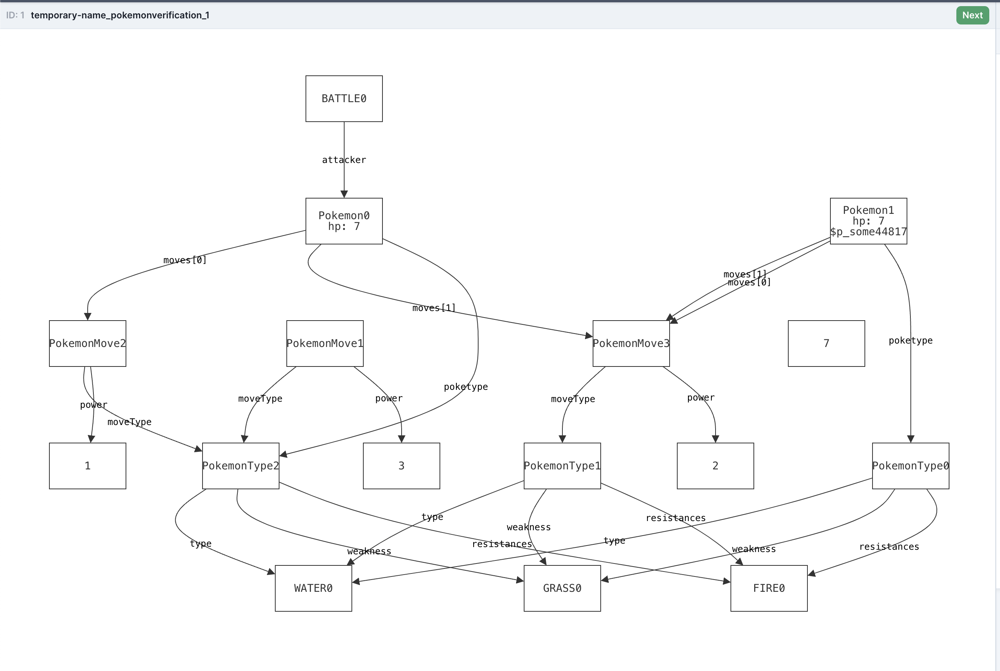
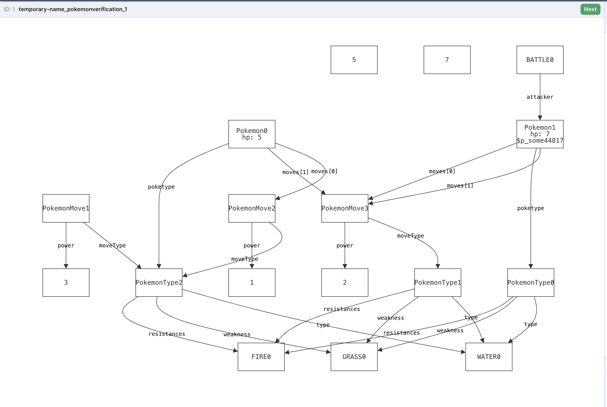
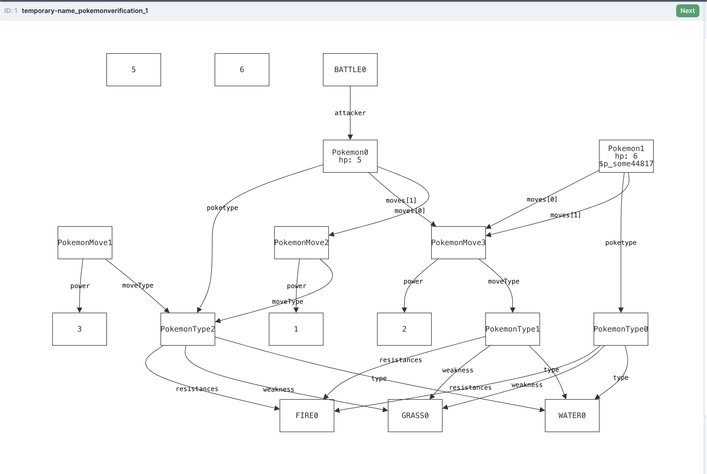
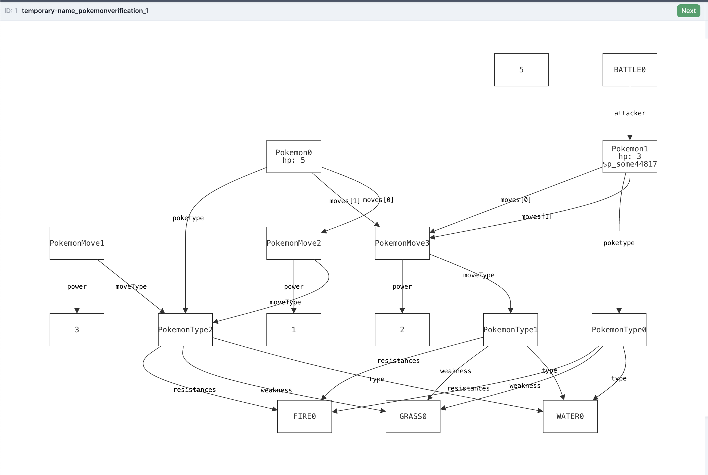

# PokemonFormalVerfication

Pokémon with Basic Stats:

Each Pokémon has a name, HP (health points), and 2 moves.
Each move has a type (fire, water, grass) and a damage value.
Turn-Based Combat System:

Two Pokémon take turns attacking each other.
A Pokémon faints when its HP reaches 0.
The battle ends when one Pokémon faints.
Type Effectiveness (Simplified):

Fire beats Grass, Grass beats Water, Water beats Fire.
If a move is super effective, it does double damage.
If a move is not very effective, it does half damage.
Basic Move Selection:

Each Pokémon has a 2 moves. A move is chosen in random. (The model chooses it automatically)

Victory Conditions:
The game ends when one Pokémon’s HP is reduced to 0.

Results:

Turn 1:

Turn 2:

Turn 3: 

Turn 4:

Turn 5:

